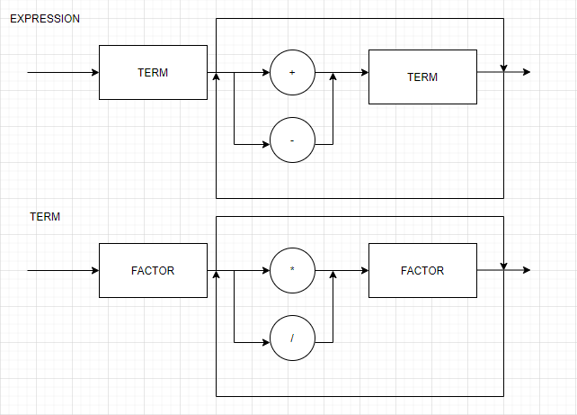
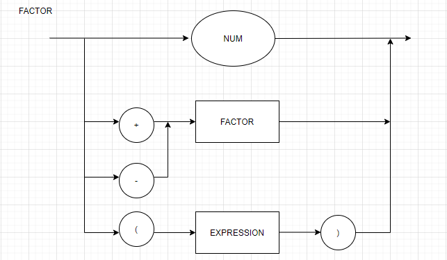

# Lógica da Computação
Repositório privado para a entrega das atividades da disciplina de Lógica da Computação. 

Para utilizar o compilador basta escrever a operação desejada no arquivo passado como argumento na chamada da função e utilizar o comando abaixo em seu prompt de comando:<br>

`python main.py <arquivo>`

Exemplo:<br>
`python main.py entrada.c`


## Diagrama Sintático



## EBNF
```
BLOCK = { COMMAND } ; 
COMMAND = ( λ | ASSIGNMENT | PRINT), ";" ; 
ASSIGNMENT = IDENTIFIER, "=", EXPRESSION ; 
PRINT = "println", "(", EXPRESSION, ")" ; 
EXPRESSION = TERM, { ("+" | "-"), TERM } ; 
TERM = FACTOR, { ("*" | "/"), FACTOR } ; 
FACTOR = (("+" | "-"), FACTOR) | NUMBER | "(", EXPRESSION, ")" | IDENTIFIER ;
IDENTIFIER = LETTER, { LETTER | DIGIT | "_" } ; 
NUMBER = DIGIT, { DIGIT } ; 
LETTER = ( a | ... | z | A | ... | Z ) ; 
DIGIT = ( 1 | 2 | 3 | 4 | 5 | 6 | 7 | 8 | 9 | 0 ) ;
```
