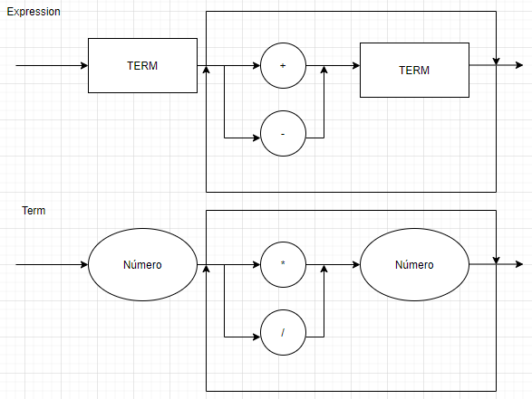

# Lógica da Computação
Repositório privado para a entrega das atividades da disciplina de Lógica da Computação. 

Para utilizar o compilador basta utilizar o comando abaixo em seu prompt de comando:<br>

`python main.py "<operações>"`

Exemplo:<br>

`python main.py "23+18/2 - 15*2"`

## Diagrama Sintático


## EBNF
```
EXPRESSION = TERM, {("+"|"-"), TERM};
TERM = NUM, {("*"|"/"), NUM};
```
