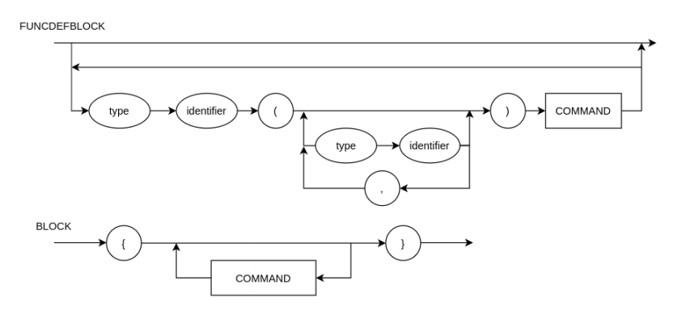
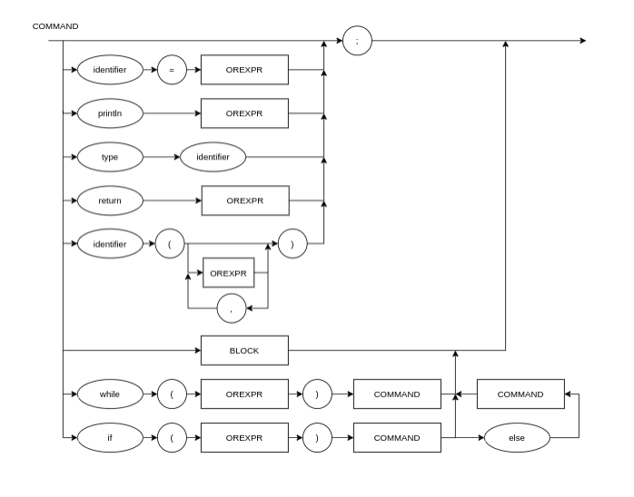
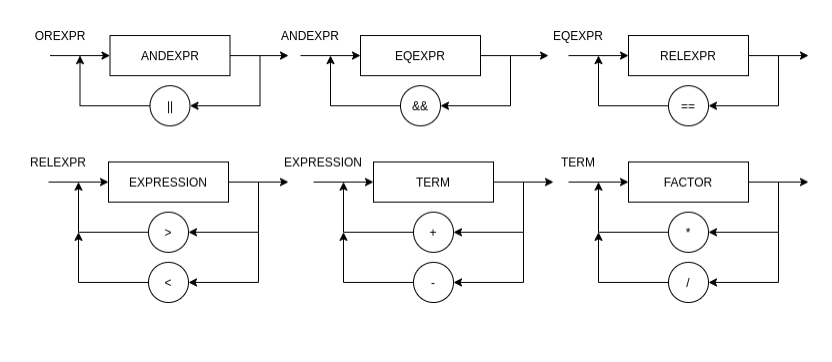
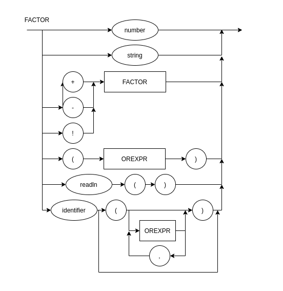

# Lógica da Computação
Repositório privado para a entrega das atividades da disciplina de Lógica da Computação. 

Para utilizar o compilador basta escrever o progama no arquivo passado como argumento na chamada da função e utilizar o comando abaixo em seu prompt de comando:<br>

`python main.py <arquivo>`

Exemplo:<br>
`python main.py entrada.c`


## Diagrama Sintático






## EBNF
```
FUNCDEFBLOCK = (λ | TYPE,IDENTIFIER, "(", {TYPE, IDENTIFIER},{(",",TYPE,IDENTIFIER)}, ")", COMMAND);
BLOCK = "{", { COMMAND }, "}" ; 
COMMAND = ( λ | ASSIGNMENT | PRINT | BLOCK | WHILE | IF | DECLARATOR | RETURN ), ";" ;
RETURN = "return", OREXPR, ";";
DECLARATOR = ("bool" | "int" | "string" ), IDENTIFIER;
WHILE = "while", "(", OREXPR ,")", COMMAND;
IF = "if", "(", OREXPR ,")", COMMAND, (("else", COMMAND) | λ );
ASSIGNMENT = IDENTIFIER, "=", EXPRESSION ; 
PRINT = "println", "(", OREXPR, ")" ; 
OREXPR = ANDEXPR, { "||", ANDEXPR } ;
ANDEXPR = EQEXPR, { "&&", EQEXPR } ;
EQEXPR = RELEXPR, { "==", RELEXPR } ;
RELEXPR = EXPRESSION, { (">"|"<"),  EXPRESSION }
EXPRESSION = TERM, { ("+" | "-"), TERM } ; 
TERM = FACTOR, { ("*" | "/"), FACTOR } ; 
FACTOR = (("+" | "-" | "!" ), FACTOR) | NUMBER | BOOL | STRING | "(", OREXPR,  ")" | IDENTIFIER | READLN;
READLN = "readln", "(",")";
IDENTIFIER = LETTER, { LETTER | DIGIT | "_" }, { "(", {(OREXPR), ","}, ")" } ; 
NUMBER = DIGIT, { DIGIT } ;
STRING = '"',{(LETTER | DIGIT)},'"';
BOOL = "true"|"false";
LETTER = ( a | ... | z | A | ... | Z ) ; 
DIGIT = ( 1 | 2 | 3 | 4 | 5 | 6 | 7 | 8 | 9 | 0 ) ;
TYPE = "bool"|"int"|"string";
```


